# Manning - Spring Microservices in Action

## A. How to Run

1. **Build Docker Images:** Execute the `setup.sh` script to build Docker images for all Spring Boot projects.
    ```sh
    bash setup.sh
    ```

2. **Launch Containers:** Start all containers using the `docker-compose.yml` file.
    ```sh
    docker-compose up
    ```

3. **Regenerate Client Secret in Keycloak:**
   - Access the Keycloak web UI.
   - Navigate to the `spmia-realm` and regenerate the `ostock` client credentials secret.

4. **Create a User in Keycloak:**
   - In the Keycloak web UI, create a user in the `spmia-realm`.
   - Ensure the user has a password-type credential and is assigned either the `ostock-admin` or `ostock-user` realm role.

## B. Endpoints

### Gateway (`http://localhost:8072`)

1. **GET /license-service/v1/organization/{organizationId}/license/{licenseId}**
   - **Description:** Retrieve license data from the license database.
   - **Path Parameters:**
     - `organizationId`: The ID of the organization.
     - `licenseId`: The ID of the license.

2. **POST /license-service/v1/organization/{organizationId}/license**
   - **Description:** Create new license data in the license database.
   - **Path Parameters:**
     - `organizationId`: The ID of the organization.
   - **Request Body:**
     ```json
     {
         "description" : "sample desc",
         "organizationId" : "e6a625cc-718b-48c2-ac76-1dfdff9a531e",
         "productName" : "licensi",
         "licenseType" : "permanen",
         "comment" : "permanen"
     }
     ```

3. **PUT /license-service/v1/organization/{organizationId}/license**
   - **Description:** Update existing license data in the license database.
   - **Path Parameters:**
     - `organizationId`: The ID of the organization.
   - **Request Body:**
     ```json
     {
         "description" : "sample desc",
         "organizationId" : "e6a625cc-718b-48c2-ac76-1dfdff9a531e",
         "productName" : "licensi",
         "licenseType" : "permanen",
         "comment" : "permanen"
     }
     ```

4. **DELETE /license-service/v1/organization/{organizationId}/license/{licenseId}**
   - **Description:** Delete license data from the license database.
   - **Path Parameters:**
     - `organizationId`: The ID of the organization.
     - `licenseId`: The ID of the license.

5. **GET /license-service/v1/organization/{organizationId}/license**
   - **Description:** Retrieve (dummy) license data from the organization service via the license service.
   - **Path Parameters:**
     - `organizationId`: The ID of the organization.
   - **Authorization:** Bearer token required.
     - `Token`: User's authenticated JWT token.

6. **GET /organization-service/v1/test**
   - **Description:** Return dummy data while sending a message to Kafka.
   - **Authorization:** Bearer token required.
     - `Token`: User's authenticated JWT token.

### Keycloak (`http://localhost:8100`)

1. **POST /realms/spmia-realm/protocol/openid-connect/token**
   - **Description:** Retrieve a JWT token from the Keycloak server using the user's password credentials.
   - **Authorization:** Basic authentication required.
     - `Username`: Keycloak realm client name.
     - `Password`: Keycloak realm client secret.
   - **Request Body (form-data):**
     - `grant_type`: Authentication grant type (use `password`).
     - `username`: User's username.
     - `password`: User's password.

## C. Screenshots
| 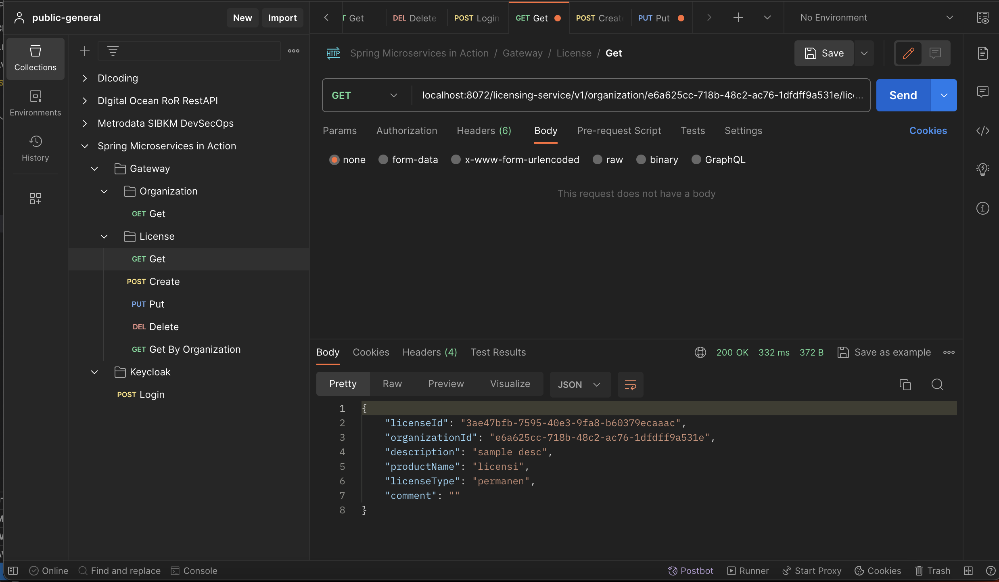 |
|:-:|
| *Figure 1. Gateway Get License by ID* |

| 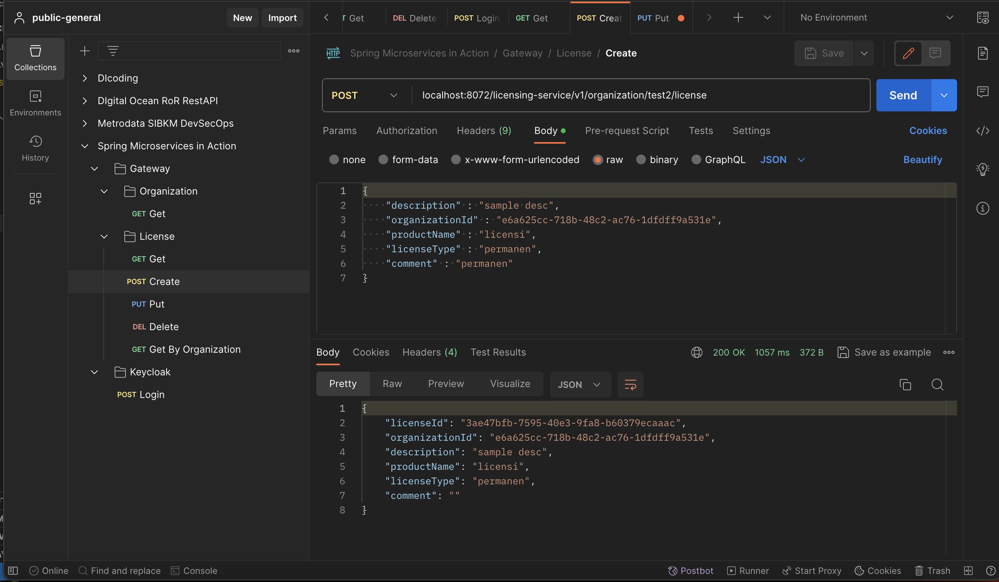 |
|:-:|
| *Figure 2. Gateway Create License* |

| 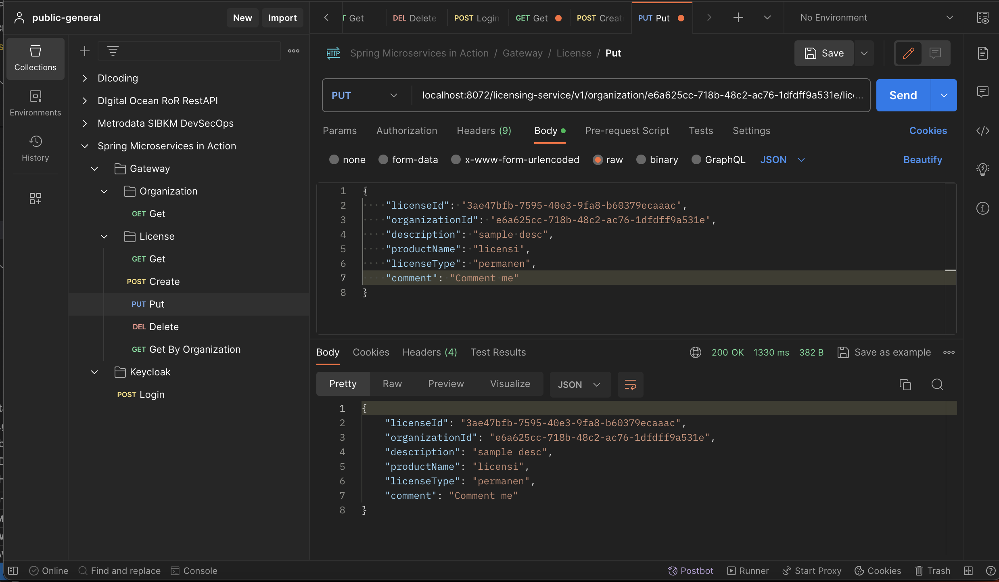 |
|:-:|
| *Figure 3. Gateway Update License* |

| 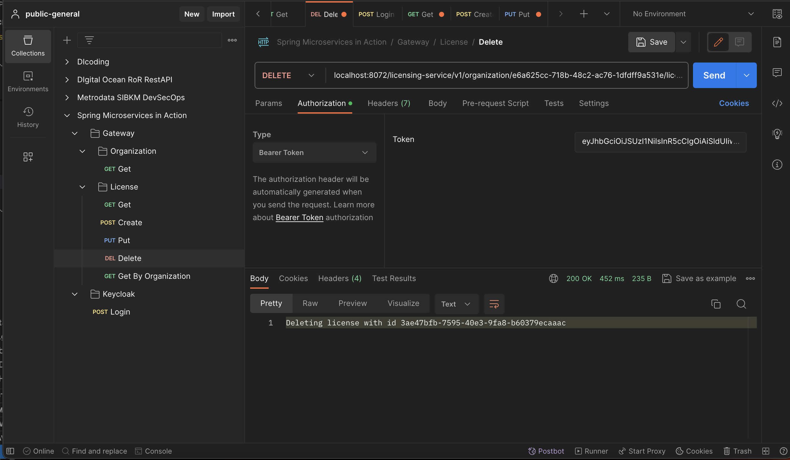 |
|:-:|
| *Figure 4. Gateway Delete License* |

| 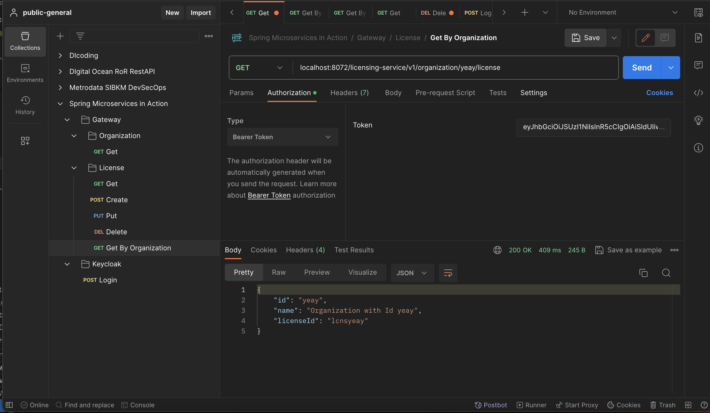 |
|:-:|
| *Figure 5. Gateway Get License by Organization* |

| 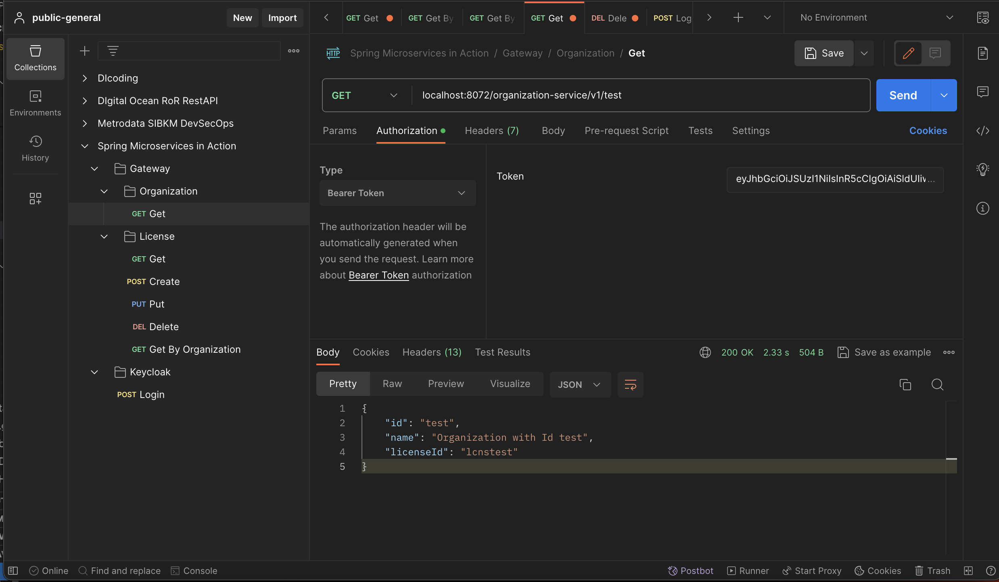 |
|:-:|
| *Figure 6. Gateway Get Organization by ID* |

| 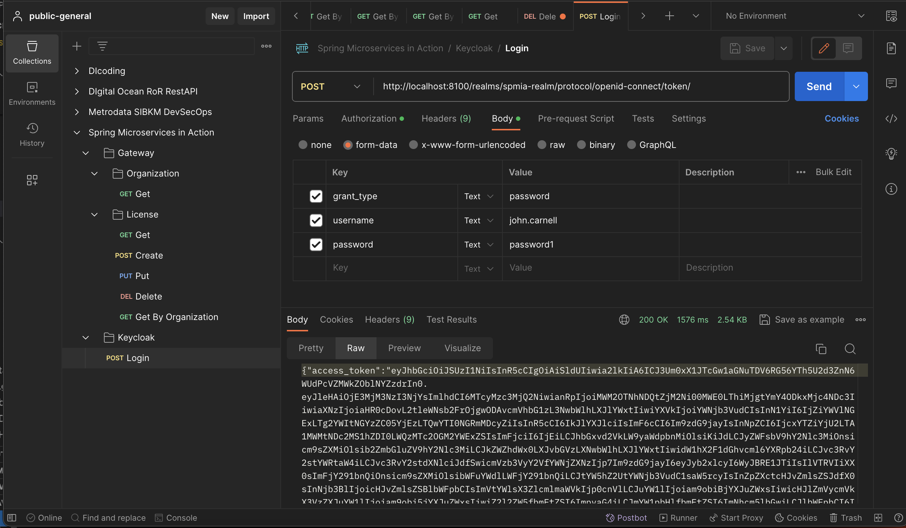 |
|:-:|
| *Figure 7. Keycloak Get Token* |

| 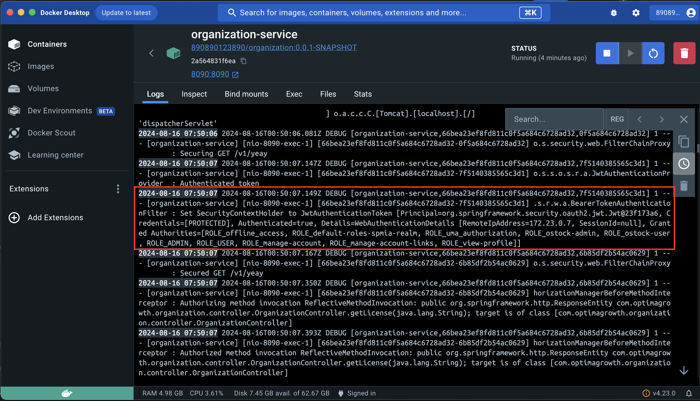 |
|:-:|
| *Figure 8. Spring Security* |

| 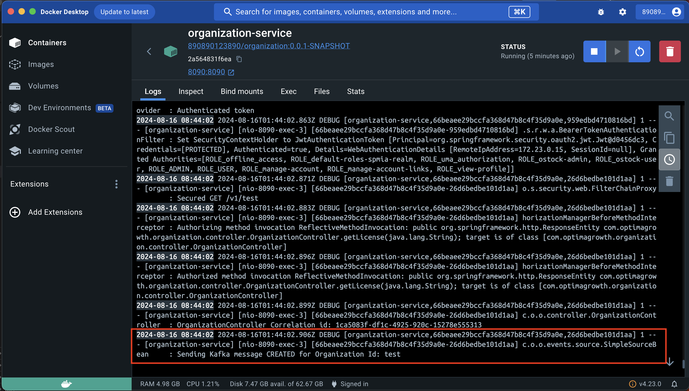 |
|:-:|
| *Figure 9. Kafka Event Producer* |

| 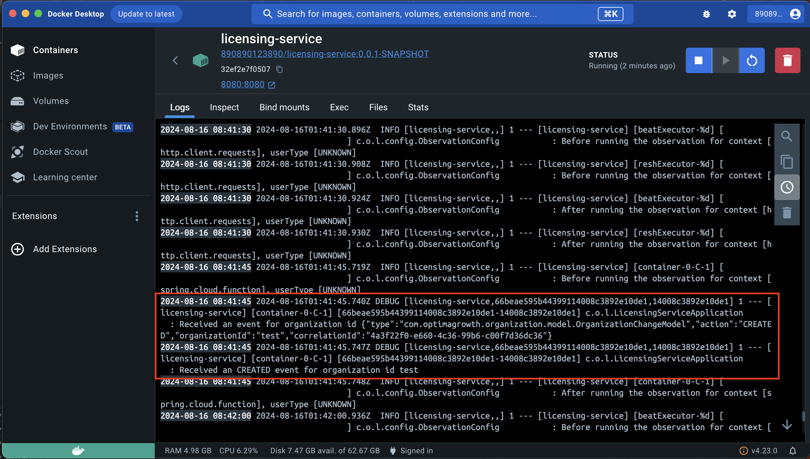 |
|:-:|
| *Figure 10. Kafka Event Consumer* |

| 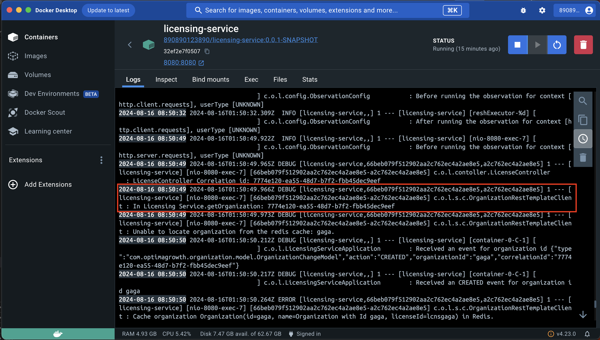 |
|:-:|
| *Figure 11. Trace Correlation ID Parent* |

| 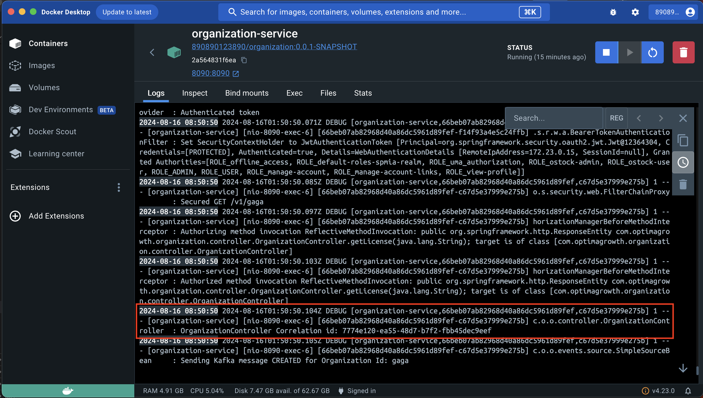 |
|:-:|
| *Figure 12. Trace Correlation ID Child* |

| 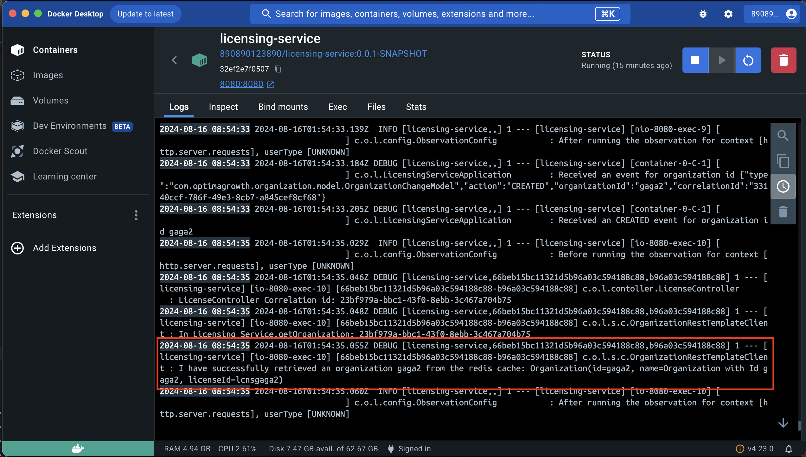 |
|:-:|
| *Figure 13. Retrieve Data from Redis* |

| 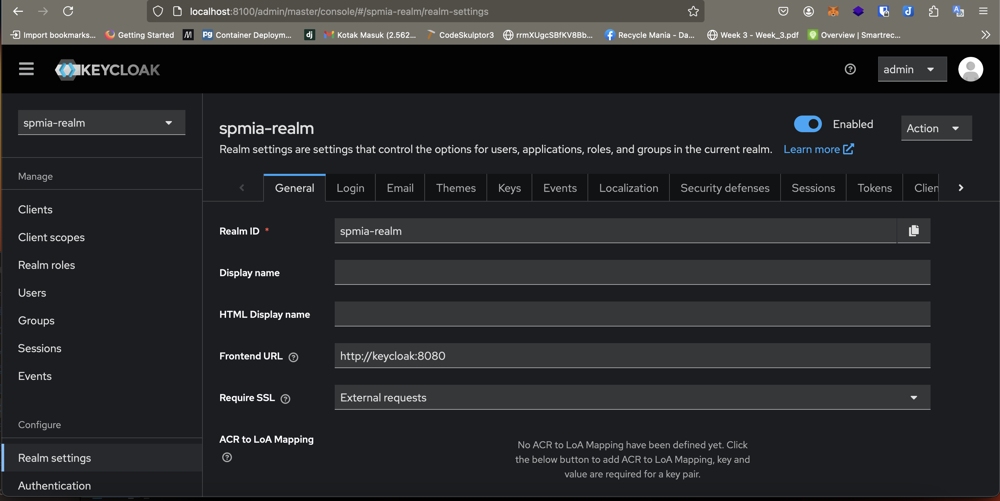 |
|:-:|
| *Figure 14. Keycloak UI* |

| 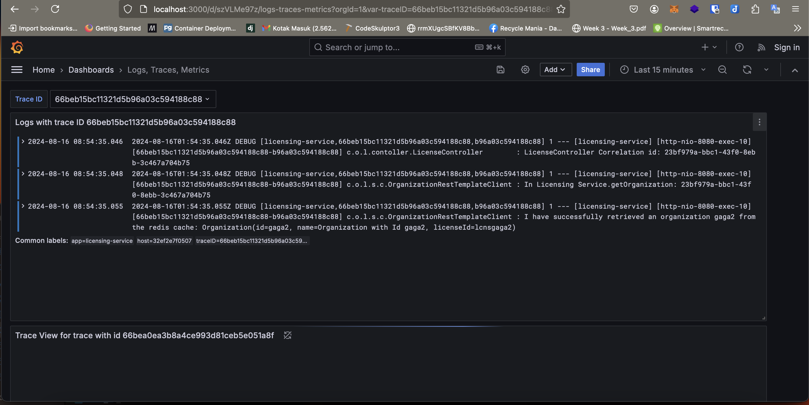 |
|:-:|
| *Figure 15. Grafana Dashboard* |

| 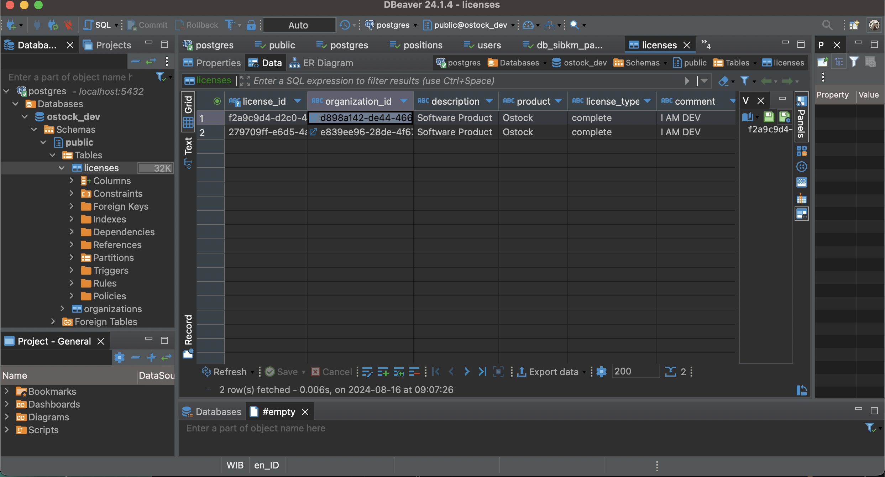 |
|:-:|
| *Figure 16. Database in DBeaver UI* |